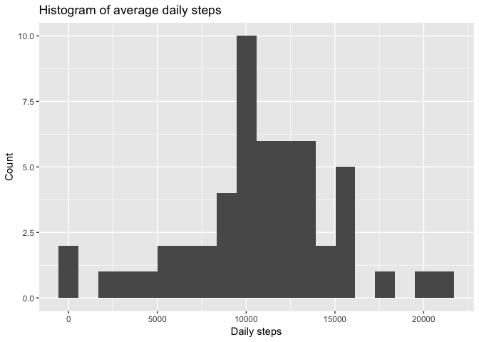
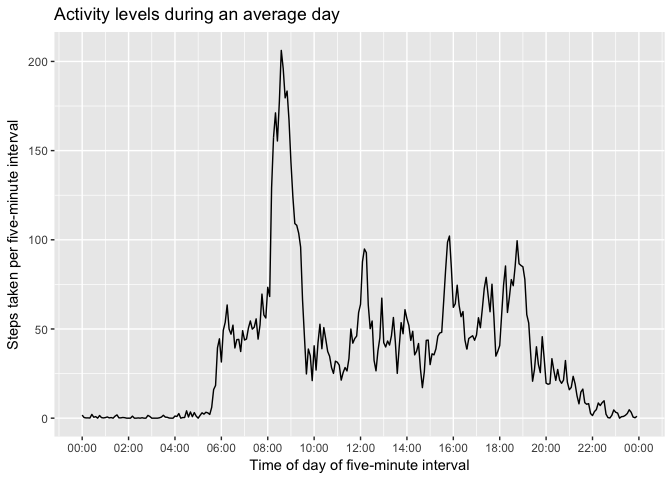
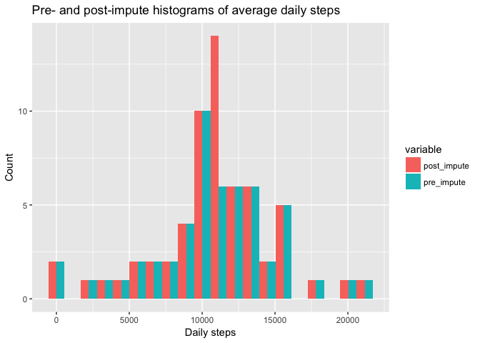
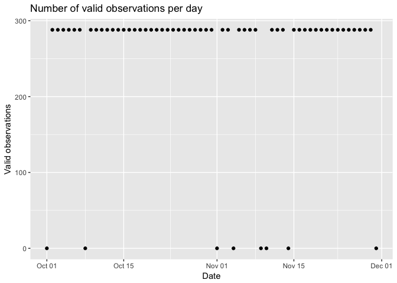
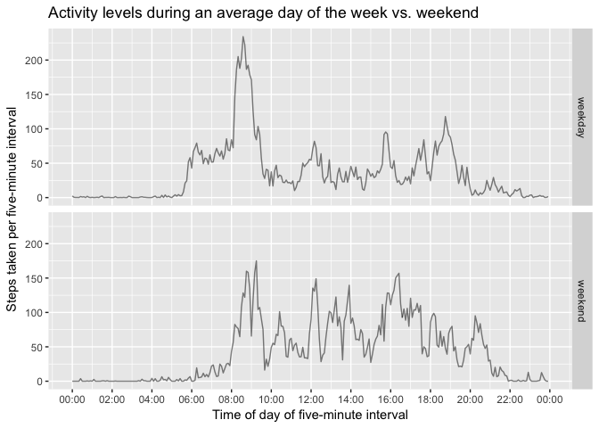

This is an exploratory analysis, in a "literate-programming" style, for peer assignment 1, _Reproducible Research_ course, _Data Science_ track by Johns Hopkins University, [Coursera](https://www.coursera.org/).

- Course home page: https://www.coursera.org/learn/reproducible-research.
- Analysis repository, forked from the course instructor's template: https://github.com/irrealis/ds05-reproducible-research-pa1.

## Introduction

Step-count data were recorded using a personal activity monitor worn by an anonymous individual for two months during October and November, 2012. Raw data are in .zip archive [_activity.zip_](https://github.com/irrealis/ds05-reproducible-research-pa1/blob/master/activity.zip), and given as time-series observations of steps taken per five-minute interval. Three variables were observed:

- `steps`: Number of steps taken with missing values coded as `NA`.

- `date`: Date of measurement in YYYY-MM-DD format.

- `interval`: Interval identifier in HHMM format with leading zeros removed, corresponding to time of day.

This analysis addresses the following questions:

- What is the mean total number of steps taken per day, averaged over all days?

- What is the average daily activity pattern, averaged for each interval over all days? Which interval contains the maximum average number of steps?

- When missing values are imputed, does the daily activity pattern change? What is the impact of imputing?

- Are there differences in activity patterns between weekdays and weekends?


## Loading and preprocessing the data

The following R packages are used:
- `data.table` is used for its simplified syntax.
- `dplyr` is used for its `mutate`, `rename`, and `filter` functions.
- `ggplot2` is used for its plotting language.
- `lubridate` is used to simplify date-related operations.
- `reshape2` is used for its `melt` function.


```r
library(data.table)
library(dplyr)
library(ggplot2)
library(lubridate)
library(reshape2)
```
  
Raw data are decompressed (if needed), then loaded.


```r
zip_file <- "activity.zip"
dat_file <- "activity.csv" 
if(!file.exists(dat_file)){ unzip(zip_file) }
raw_data <- read.csv(dat_file)
```

The following preprocessing steps are taken:

- The `interval` column is converted to a factor in order to simplify debugging.
- The `steps` column is converted to floating-point so that missing values can be imputed as floating-point.
- The `date` column is converted to `Date` in order to show dates on the X axes of later plots.
- The data are converted to `data.table` for simplified syntax.


```r
activity <- raw_data %>%
  mutate(
    interval = as.factor(interval),
    steps = as.numeric(steps),
    date = ymd(date),
  ) %>%
  data.table()
```


## What is the mean total number of steps taken per day?

To estimate this mean, daily steps are totaled, and will subsequently be averaged.


```r
daily_steps <- aggregate(steps ~ date, activity, sum)
```

The distribution of daily step totals is visualized via histogram:


```r
ggplot(daily_steps, aes(steps)) +
  geom_histogram(bins=20) +
  labs(
    title = "Histogram of average daily steps",
    x = "Daily steps",
    y = "Count"
  )
```

<!-- -->


Mean and median daily steps are estimated as 10766 and 10765, respectively:


```r
mean_daily_steps <- mean(daily_steps$steps)
median_daily_steps <- median(daily_steps$steps)
mean_daily_steps
```

```
## [1] 10766.19
```

```r
median_daily_steps
```

```
## [1] 10765
```


## What is the average daily activity pattern?

The following are done to prepare data for visualization:

- Steps taken from midnight to 00:05 are averaged over all days. This is repeated for each subsequent five-minute interval.
- Interval IDs are converted to a `time_of_day` column of datatype `POSIXct`, in order to show time of day on the X axis of the subsequent plot. (Note: a "placeholder" date of `today()==`2018-06-05 is used to satisfy the plotting system.)


```r
mean_steps_per_interval <- aggregate(
  steps ~ interval,
  activity,
  mean
) %>%
  rename(mean_steps = steps) %>%
  mutate(
    time_of_day = fast_strptime(
      paste(
        today(),
        sprintf("%04d", as.integer(as.character(interval)))
      ),
      "%Y-%m-%d %H%M",
      lt = F
    )
  )
```

Activity over the course of an average day is visualized as a time-series plot:


```r
ggplot(mean_steps_per_interval, aes(x=time_of_day, y=mean_steps, group=1)) +
  geom_line() +
  scale_x_datetime(date_breaks = "2 hour", date_labels = "%H:%M") +
  labs(
    title = "Activity levels during an average day",
    x = "Time of day of five-minute interval",
    y = "Steps taken per five-minute interval"
  )
```

<!-- -->


On an average day, the maximum number of steps (206) is taken at 08:35:

  
  ```r
  max_mean_steps_per_interval <- mean_steps_per_interval %>%
    filter(mean_steps == max(mean_steps))
  max_mean_steps_per_interval
  ```
  
  ```
  ##   interval mean_steps         time_of_day
  ## 1      835   206.1698 2018-06-05 08:35:00
  ```


## Imputing missing values


2304 values are missing from the `steps` column, and will be imputed.


```r
is_missing <- is.na(activity$steps)
missing_count <- sum(is_missing)
missing_count
```

```
## [1] 2304
```

Per assignment instructions, instead of a sophisticated imputation, the mean number of steps in a given five-minute interval will be used to impute missing values in that interval.

- A new column `mean_steps` is added to table `activity` using data from table `mean_steps_per_interval` by merging the latter into the former, joining on `interval`.
- Missing entries in column `steps` are replaced using `mean_steps` column data from the same row.
  

```r
imputed_by_interval <- merge(
  activity,
  mean_steps_per_interval,
  sort = F
)
imputed_by_interval[, steps := ifelse(is.na(steps), mean_steps, steps)]
```

The following steps are taken to prepare for visualization:

- As before imputating, daily steps are totaled.
- Post- and pre-impute daily steps are merged using `date` as left-join column. This allows melting to long format, which will be used to plot pre- and post-impute histograms for comparison.
  - A left join is used to preserve post-impute data.
- After melting, the `steps` column contains pre-impute `NA`s, which are filtered out.
- The result is converted to `data.table`, permitting simplified syntax.


```r
daily_steps_post_impute <- aggregate(
  steps ~ date,
  imputed_by_interval,
  sum
) %>%
  rename(post_impute = steps) %>%
  merge(daily_steps, all.x = T) %>%
  rename(pre_impute = steps) %>%
  melt(id.vars = c("date"), value.name = "steps") %>%
  filter(!is.na(steps)) %>%
  data.table()
```
  
The pre- and post-impute histograms are plotted side-by-side for comparison.
  

```r
ggplot(daily_steps_post_impute, aes(steps, fill = variable)) +
  geom_histogram(bins = 20, position = "dodge") +
  labs(
    title = "Pre- and post-impute histograms of average daily steps",
    x = "Daily steps",
    y = "Count"
  )
```

<!-- -->
  


The above histograms are surprisingly identical with one exception: the count is approximately doubled for the post-impute bin containing the mean. Post-impute mean and median daily steps are estimated as 10766 and 10766, respectively. That the pre- and post-impute mean estimates are identical is again surprising, but consistent with the histogram comparison. The post-impute median estimate equals the estimated mean.


```r
mean_daily_steps_post_impute <- mean(
  daily_steps_post_impute[variable == "post_impute", steps]
)
median_daily_steps_post_impute <- median(
  daily_steps_post_impute[variable == "post_impute", steps]
)
mean_daily_steps
```

```
## [1] 10766.19
```

```r
mean_daily_steps_post_impute
```

```
## [1] 10766.19
```

```r
median_daily_steps
```

```
## [1] 10765
```

```r
median_daily_steps_post_impute
```

```
## [1] 10766.19
```

The reasons for identical mean estimates and identical histograms, save for one doubled bin count, is revealed by plotting the number of valid observations per day:
  

```r
daily_valid_entries <- aggregate(
  steps ~ date,
  activity,
  function(v) {sum(complete.cases(v))},
  na.action = NULL
) %>%
  rename(complete_cases = steps)
ggplot(daily_valid_entries, aes(x = date, y = complete_cases)) +
  geom_point() +
  labs(
    title = "Number of valid observations per day",
    x = "Date",
    y = "Valid observations"
  )
```

<!-- -->
  
On eight days, all entries are missing. For all other days, all entries are valid (numbering 288 per day). Thus exactly eight complete average days were imputed, which has these effects:

- Because the mean of the mean is the identity operation, and eight complete average days were imputed, the estimated mean is unchanged post-impute.
- The count of the histogram bin containing the mean is increased by eight, corresponding to the eight imputed average days.


## Are there differences in activity patterns between weekdays and weekends?

This will be answered by comparing time-series activity-level plots for weekdays and weekends. To begin, a new factor variable `weekday_or_weekend` is added.


```r
activity_weekday_or_weekend <- activity %>%
  mutate(
    weekday_or_weekend = factor(
      ifelse(
        weekdays(date) %in% c("Saturday", "Sunday"),
        "weekend",
        "weekday"
      )
    )
  )
```

To prepare for visualization, the following steps are taken:  
  
- Interval step counts are averaged for weekdays and weekends.
- Interval IDs are converted to `time_of_day` in order to show time of day on the X axis.


```r
mean_steps_per_interval_and_weekday_or_weekend <- aggregate(
  steps ~ interval + weekday_or_weekend,
  activity_weekday_or_weekend,
  mean
) %>%
  rename(mean_steps = steps) %>%
  mutate(
    time_of_day = fast_strptime(
      paste(
        today(),
        sprintf("%04d", as.integer(as.character(interval)))
      ),
      "%Y-%m-%d %H%M",
      lt = F
    )
  )
```

Weekday and weekend activity are visualized for comparison using a panel of time-series plots:


```r
ggplot(
  mean_steps_per_interval_and_weekday_or_weekend,
  aes(x=time_of_day, y=mean_steps, group=1)
) +
  geom_line(alpha = 0.5) +
  scale_x_datetime(date_breaks = "2 hour", date_labels = "%H:%M") +
  facet_grid(weekday_or_weekend ~ .) +
  labs(
    title = "Activity levels during an average day of the week vs. weekend",
    x = "Time of day of five-minute interval",
    y = "Steps taken per five-minute interval"
  )
```

<!-- -->

The 08:35 spike in average daily activity level seems well-preserved in the weekday time-series plot, but less so in the weekend plot. Moreover, compared to weekdays, weekend activity seems to generally increase during waking hours.


## Final rendering of this document

Although assigment instructions state `knitr::knit2html` should be used to render this document, doing so triggers the following error:


```r
knitr::knit2html('PA1_template.Rmd')
```

Thus `rmarkdown::render` will be used instead:


```r
render('PA1_template.Rmd', output_format = 'html_document')
```

_This place figures beneath `PA1_template_files/figure-html/` rather than the instructed `figures/`:_

```
PA1_template_files
└── figure-html
    ├── unnamed-chunk-16-1.png
    ├── unnamed-chunk-19-1.png
    ├── unnamed-chunk-22-1.png
    ├── unnamed-chunk-5-1.png
    └── unnamed-chunk-9-1.png
```

Accordingly, `PA1_template_files/figure-html/` rather than `figures/` will be committed to the GitHub repo to submit this assignment.
